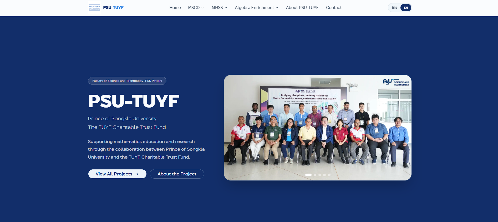

# 🎓 โครงการ PSU-TUYF (Prince of Songkla University - TUYF Charitable Trust Fund Website)

เว็บไซต์อย่างเป็นทางการของ **โครงการ PSU-TUYF** ซึ่งเป็นโครงการยกระดับคุณภาพการศึกษาและการวิจัยในสาขาคณิตศาสตร์ ภายใต้ความร่วมมือระหว่าง **มหาวิทยาลัยสงขลานครินทร์ (ม.อ.)** และ **กองทุนการกุศล TUYF (TUYF Charitable Trust Fund)**

---

## 🚀 ฟีเจอร์สำคัญของระบบ (Key Features)

- **ระบบรองรับ 2 ภาษา (Localization - i18n):** แสดงผลได้ทั้งภาษาไทย (TH) และภาษาอังกฤษ (EN) ผ่าน `react-i18next`
- **โครงสร้างทันสมัย (Modern Tech Stack):** ขับเคลื่อนด้วย **Next.js 16 (App Router)**, **React 19** และ **TypeScript**
- **การจัดแต่งสไตล์แบบพรีเมียม (Styling):** ใช้ **Tailwind CSS v4** พร้อมจัดระเบียบ UI Component ด้วย **shadcn/ui** และการทำ Responsive Design รองรับทุกอุปกรณ์
- **แยกส่วนข้อมูลตามโครงการหลักอย่างชัดเจน:**
  1. **MSCD (Mathematics for Sustainable Community Development):** โครงการพัฒนาชุมชนอย่างยั่งยืนด้วยคณิตศาสตร์ (ทุนปริญญาตรี บูรณาการนักเรียนมัธยมปลาย และพัฒนาครูคณิตศาสตร์ในพื้นที่สามจังหวัดชายแดนใต้)
  2. **MGSS (Mathematical Graduated Students Supporting Project):** ทุนสนับสนุนการศึกษาระดับบัณฑิตศึกษา (ป.โท และ ป.เอก) ด้านคณิตศาสตร์และคณิตศาสตร์ประยุกต์
  3. **Algebra Enrichment Project:** โครงการเสริมสร้างความเข้มแข็งทางพีชคณิต และศูนย์พีชคณิตภาคใต้

---

## 🛠️ เทคโนโลยีที่ใช้ในโปรเจกต์ (Tech Stack)

- **Framework:** [Next.js 16 (App Router)](https://nextjs.org/)
- **UI Library:** [React 19](https://react.dev/) & [TypeScript](https://www.typescriptlang.org/)
- **Styling:** [Tailwind CSS v4](https://tailwindcss.com/) & [shadcn/ui](https://ui.shadcn.com/)
- **State & Utils:** `class-variance-authority`, `clsx`, `tailwind-merge`, `lucide-react`
- **Internationalization:** `i18next` & `react-i18next`
- **Package Manager:** `pnpm`

---

## 📂 โครงสร้างโฟลเดอร์ในโปรเจกต์ (Folder Structure)

อ้างอิงตามข้อตกลงในการพัฒนาใน [src/structures.md](file:///d:/Project-Website/psu-tuyf/src/structures.md) โครงสร้างโฟลเดอร์หลักจัดวางดังนี้:

```markdown
src/
├── 📁 app/
│   ├── 📁 home/
│   │   ├── 📁 components/
│   │   └── 📄 page.tsx
│   ├── 📁 mscd/
│   │   ├── 📁 components/
│   │   └── 📄 page.tsx
│   ├── 📁 mgss/
│   ├── 📁 algebra-enrichment/
│   ├── 📁 about/
│   ├── 📁 contact/
│   ├── 📄 layout.tsx
│   └── 📄 globals.css
│
├── 📁 components/
│   ├── 📁 ui/
│   ├── 📄 project-card.tsx
│   ├── 📄 language-context.tsx
│   ├── 📄 scroll-to-top.tsx
│   ├── 📄 site-header.tsx
│   └── 📄 site-footer.tsx
│
├── 📁 layout/
│   └── 📄 main-layout.tsx
│
└── 📁 lib/
    ├── 📄 i18n.ts
    └── 📄 utils.ts
```

---

## ⚙️ วิธีการเริ่มใช้งานและการพัฒนาต่อ (Getting Started)

ก่อนเริ่มต้นใช้งาน กรุณาตรวจสอบให้แน่ใจว่าติดตั้ง **Node.js (เวอร์ชัน 18 ขึ้นไป)** และ **pnpm** เรียบร้อยแล้ว

### 1. ติดตั้ง Dependencies ทั้งหมด
รันคำสั่งต่อไปนี้ที่โฟลเดอร์หลักของโปรเจกต์:
```bash
pnpm install
```

### 2. รันเซิร์ฟเวอร์เพื่อการพัฒนา (Development Mode)
เริ่มต้นทดสอบและเขียนโค้ดหน้าเว็บแบบ Real-time:
```bash
pnpm dev
```
จากนั้นเปิดเบราว์เซอร์และเข้าไปที่ลิงก์ [http://localhost:3000](http://localhost:3000)

### 3. ตรวจสอบความถูกต้องและสร้างไฟล์สำหรับใช้งานจริง (Production Build)
สร้างโค้ดที่มีการ Optimize เพื่อความรวดเร็วและพร้อมสำหรับการ Deploy ขึ้นเซิร์ฟเวอร์จริง:
```bash
pnpm build
```

### 4. รันระบบเซิร์ฟเวอร์หลังการ Build (Production Mode)
รันไฟล์เว็บด้วยโค้ดเวอร์ชันที่เสร็จสมบูรณ์:
```bash
pnpm start
```

